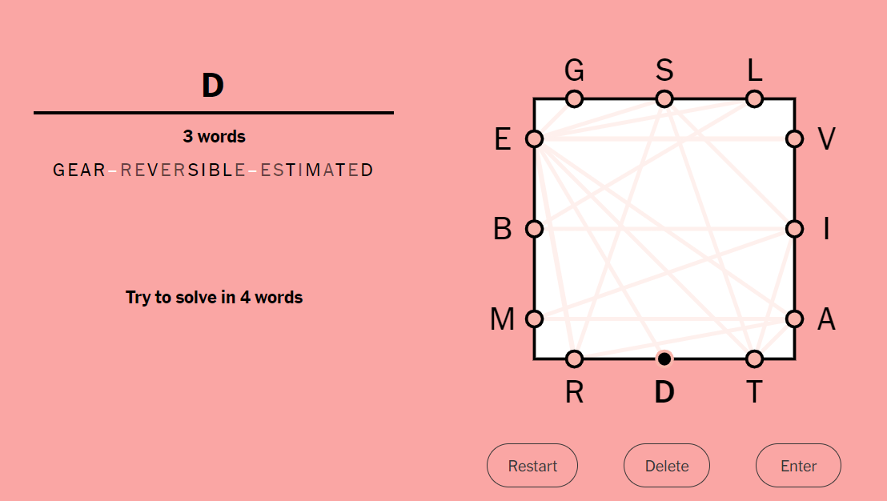

# Letter_Boxed

Ever wonder if you can "hack" one of the New York Times puzzle games? Or just competing with your friends and you just completely destroy them ranking on top of a game? Well look no further than using Letter Boxed Solver to now solve the New York Times Letter-Boxed game! This code uses recursive backtracking algorithm to find the best optimal word or backtrack to previous optimal prefix/word to try again if there are no prefix/word that exist in the dictionary. Just like the New York Times Letter Boxed game, when it finds a optimal word, the next word will have to start with whatever the last letter was in the previous word and it will find all the words given the limited number of words that you have to solve it. to The user interface is very simple to use as all you need is to type in the letters from each side of the box which the NYT Letter Boxed game will provide you with to solve and the algorithm will run to find all the words for the daily game.

# Instructions: 
Compile the LetterSquare.java file using a text editor. Make sure to have downloaded all the necessary file to compile java code!

# Here is the link of the New York Times Letter Boxed Game that you can try to test this algorithm out!

https://www.nytimes.com/puzzles/letter-boxed

# Here is the user interface of how to type in the letters from each side of the box:

# Here is the solutions that it provided based on the daily Letter Boxed Game:

# Congratulations! You've solved the game for the day!

# The solution and the Letter Box layout from the New York Times Letter Boxed Game

